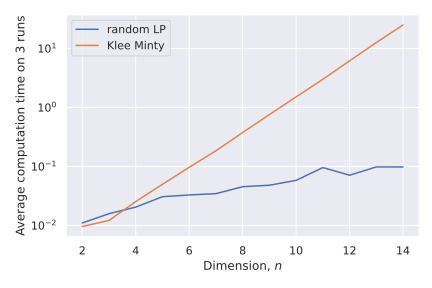

# Introduction to Linear Programming
## What is LP

Generally speaking, all problems with linear objective and linear equalities\inequalities constraints could be considered as Linear Programming. However, there are some widely accepted formulations.

$$
\tag{LP.Basic}
\begin{align*}
&\min_{x \in \mathbb{R}^n} c^{\top}x \\
\text{s.t. } & Ax \leq b\\
\end{align*}
$$

for some vectors $$c \in \mathbb{R}^n$$, $$b \in \mathbb{R}^m$$ and matrix $$A \in \mathbb{R}^{m \times n}$$. Where the inequalities are interpreted component-wise.

### Standard form
This form seems to be the most intuitive and geometric in terms of visualization. Let us have vectors $$c \in \mathbb{R}^n$$, $$b \in \mathbb{R}^m$$ and matrix $$A \in \mathbb{R}^{m \times n}$$.

$$
\tag{LP.Standard}
\begin{align*}
&\min_{x \in \mathbb{R}^n} c^{\top}x \\
\text{s.t. } & Ax = b\\
& x_i \geq 0, \; i = 1,\dots, n
\end{align*}
$$

### Canonical form

$$
\tag{LP.Canonical}
\begin{align*}
&\min_{x \in \mathbb{R}^n} c^{\top}x \\
\text{s.t. } & Ax \leq b\\
& x_i \geq 0, \; i = 1,\dots, n
\end{align*}
$$

### Real world problems

#### Diet problem
Imagine, that you have to construct a diet plan from some set of products: 🍌🍰🍗🥚🐟. Each of the products has its own vector of nutrients. Thus, all the food information could be processed through the matrix $$W$$. Let also assume, that we have the vector of requirements for each of nutrients $$r \in \mathbb{R}^n$$. We need to find the cheapest configuration of the diet, which meets all the requirements:

$$
\begin{align*}
&\min_{x \in \mathbb{R}^p} c^{\top}x \\
\text{s.t. } & Wx \geq r\\
& x_i \geq 0, \; i = 1,\dots, n
\end{align*}
$$

## How to retrieve LP
### Basic transformations
Inequality to equality by increasing the dimension of the problem by $$m$$.

$$
Ax \leq b \leftrightarrow 
\begin{cases}
Ax + z =  b\\
z \geq 0
\end{cases}
$$

unsigned variables to nonnegative variables.

$$
x \leftrightarrow 
\begin{cases}
x = x_+ - x_-\\
x_+ \geq 0 \\
x_- \geq 0
\end{cases}
$$

### Chebyshev approximation problem

$$
\min_{x \in \mathbb{R}^n} \|Ax - b\|_\infty \leftrightarrow \min_{x \in \mathbb{R}^n} \max_{i} |a_i^\top x - b_i|
$$

$$
\begin{align*}
&\min_{t \in \mathbb{R}, x \in \mathbb{R}^n} t \\
\text{s.t. } & a_i^\top x - b_i \leq t, \; i = 1,\dots, n\\
& -a_i^\top x + b_i \leq t, \; i = 1,\dots, n
\end{align*}
$$

### $$l_1$$ approximation problem

$$
\min_{x \in \mathbb{R}^n} \|Ax - b\|_1 \leftrightarrow \min_{x \in \mathbb{R}^n} \sum_{i=1}^n |a_i^\top x - b_i|
$$

$$
\begin{align*}
&\min_{t \in \mathbb{R}^n, x \in \mathbb{R}^n} \mathbf{1}^\top t \\
\text{s.t. } & a_i^\top x - b_i \leq t_i, \; i = 1,\dots, n\\
& -a_i^\top x + b_i \leq t_i, \; i = 1,\dots, n
\end{align*}
$$

## Idea of simplex algorithm

## Convergence
### [Klee Minty](https://en.wikipedia.org/wiki/Klee%E2%80%93Minty_cube) example

In the following problem simplex algorithm needs to check $$2^n - 1$$ vertexes with $$x_0 = 0$$. 

$$
\begin{align*} & \max_{x \in \mathbb{R}^n} 2^{n-1}x_1 + 2^{n-2}x_2 + \dots + 2x_{n-1} + x_n\\
\text{s.t. } & x_1 \leq 5\\
& 4x_1 + x_2 \leq 25\\
& 8x_1 + 4x_2 + x_3 \leq 125\\
& \ldots\\
& 2^n x_1 + 2^{n-1}x_2 + 2^{n-2}x_3 + \ldots + x_n \leq 5^n\ & x \geq 0 
\end{align*}
$$

## Summary
* A wide variety of applications could be formulated as the linear programming.
* Simplex algorithm is simple, but could work exponentially long.
* Khachiyan’s ellipsoid method is the first to be proved running at polynomial complexity for LPs. However, it is usually slower than simplex in real problems.
* Interior point methods are the last word in this area. However, good implementations of simplex-based methods and interior point methods are similar for routine applications of linear programming.

## Code

## Materials

* [Linear Programming.](https://yadi.sk/i/uhmarI88kCRfw) in V. Lempitsky optimization course.
* [Simplex method.](https://yadi.sk/i/lzCxOVbnkFfZc) in V. Lempitsky optimization course.
* [Overview of different LP solvers](https://medium.com/opex-analytics/optimization-modeling-in-python-pulp-gurobi-and-cplex-83a62129807a)
* [TED talks watching optimization](https://www.analyticsvidhya.com/blog/2017/10/linear-optimization-in-python/)
* [Overview of ellipsoid method](https://www.stat.cmu.edu/~ryantibs/convexopt-F13/scribes/lec15.pdf)
* [Comprehensive overview of linear programming](http://www.mit.edu/~kircher/lp.pdf)
* [Converting LP to a standard form](https://sites.math.washington.edu/~burke/crs/407/lectures/L4-lp_standard_form.pdf)
